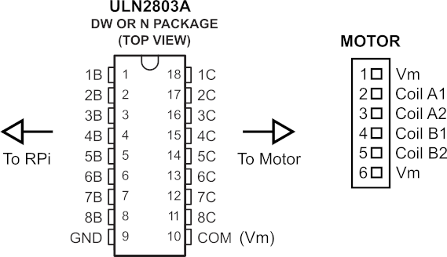

# RPistepper

RPistepper is a library containing:
* A class to control a stepper motor with a RPi.
* A function to execute a zig-zag motion with two motors.

## Wiring
In our setup, the power to the motors (Vm) is supplied with the 5V pins of the RPi, the grounding of the coils is controlled with a [ULN2803A](http://www.ti.com/lit/ds/symlink/uln2803a.pdf) transistor array.



#### Conections RPi - ULN2803A:

| RPi Pin (BCM)| ULN2803A|
|--------------|---------|
|      17      |    1B   |
|      27      |    2B   |
|      10      |    3B   |
|      9       |    4B   |
|      14      |    5B   |
|      15      |    6B   |
|      23      |    7B   |
|      24      |    8B   |

#### Conections ULN2803A - Motors:

| ULN2803A| Motors          |
|---------|-----------------|
|    1B   | Motor 1 Coil A1 |
|    2B   | Motor 1 Coil A2 |
|    3B   | Motor 1 Coil B1 |
|    4B   | Motor 1 Coil B2 |
|    5B   | Motor 2 Coil A1 |
|    6B   | Motor 2 Coil A2 |
|    7B   | Motor 2 Coil B1 |
|    8B   | Motor 2 Coil B2 |

In this case, two motors were attached to the ULN2803A.


## Usage
### class StepperPi
This class allows the user to control a 4 pin stepper motor using 4 GPIO pins of a RPi. Software uses BCM mode for pin indexing.
Arguments are a list with the 4 pins: `pins = [Coil_A1, Coil_A2, Coil_B1, Coil_B2]`
The delay between steps (default = 20ms) is an optional argument
This class is best used with the `with` statement to propperly handle the cleanup of the GPIOs.
e.g:
```python
import RPistepper
M1_pins = [17, 27, 10, 9]
with RPistepper.RPistepper(M1_pins) as M1:
    for i in range(10):               # moves 20 steps,release and wait
        print M1
        M1.move(20)
        M1.release()
        raw_input('enter to execute next step')
```

#### Methods
Currently there are three implemented methods:
```python
def move(self, steps):
    '''
    Moves the motor 'steps' steps. Negative steps moves the motor backwards
    '''
```
```python
def release(self):
    '''
    Sets all pins low. Power saving mode
    '''
```
```python
def reset(self):
    '''
    Returns the motor to it's initial position
    '''
```
The main method is `move`, which moves the motor the desired number of steps
### function zig_zag
zig_zag executes a routine with two stepper motors:
```python
def zig_zag(motor1, motor2, amp1, amp2, delay=None):
    '''
    Executes a zig-zag moviment with two RPistepper objects.
    Arguments are: motor1 and motor2 objects and amp1, amp2, the amplitude
    of movement, a tuple (step, rep) representing the number of steps per
    iteration and the number of iterations of the following algorithm:
        Repeat rep1 times:
            1. Moves motor 2 step2*rep2 steps forward
            2. Moves motor 1 step1 steps forward
            3. Moves motor 2 step2*rep2 steps backwards
            4. Moves motor 1 step1 steps forward
        Reset to initial state
    It's possible to change the delay between steps with the 'delay' argument
    '''
```
e.g.
```python
import RPistepper
M1_pins = [17, 27, 10, 9]
M2_pins = [14, 15, 23, 24]
with RPistepper.RPistepper(M1_pins) as M1, RPistepper.RPistepper(M2_pins) as M2:
    zig_zag(M1, M2, (5, 10), (5, 10))   # execute zig-zag
```
